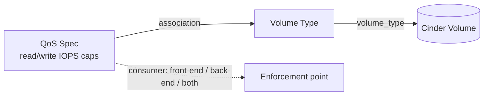

# Cinder Volume With QoS

> **Primary search phrase:** Terraform OpenStack volume QoS example

## Architecture



## Usage

```bash
export OS_CLOUD=openstack
cp terraform.tfvars.example terraform.tfvars
# edit terraform.tfvars to taste

terraform init
terraform plan
terraform apply
```

> **Admin only:** creating QoS specs and QoS-to-volume-type associations
> requires the **admin** role. A non-admin apply will fail with an
> authorization error.

## Inputs

| Name                      | Description                                                                                                   | Type          | Default                                              |
| ------------------------- | ------------------------------------------------------------------------------------------------------------ | ------------- | ---------------------------------------------------- |
| `cloud`                   | Name of the cloud entry in clouds.yaml to use (via OS_CLOUD or the provider 'cloud' argument).               | `string`      | `"openstack"`                                        |
| `qos_name`                | Name of the Cinder QoS specification.                                                                         | `string`      | `"high-iops"`                                        |
| `qos_consumer`            | Where the QoS limits are enforced: front-end (Nova/hypervisor), back-end (Cinder driver), or both.           | `string`      | `"front-end"`                                        |
| `qos_specs`               | Map of QoS specs (e.g. IOPS/throughput caps) applied to the volume type.                                     | `map(string)` | `{ read_iops_sec = "2000", write_iops_sec = "1000" }` |
| `volume_type_name`        | Name of the volume type the QoS spec is associated with.                                                     | `string`      | `"high-iops"`                                        |
| `volume_type_description` | Human-readable description for the volume type.                                                              | `string`      | `"QoS-limited volume type"`                          |
| `volume_name`             | Name of the Cinder volume created from the QoS-limited type.                                                 | `string`      | `"example-qos-volume"`                               |
| `volume_size`             | Size of the volume in GiB.                                                                                    | `number`      | `10`                                                 |

## Outputs

| Name             | Description                                       |
| ---------------- | ------------------------------------------------- |
| `qos_id`         | ID of the Cinder QoS specification.               |
| `volume_type_id` | ID of the volume type associated with the QoS spec. |
| `volume_id`      | ID of the QoS-limited Cinder volume.              |

## Best practices

- Express QoS limits (`read_iops_sec`, `write_iops_sec`, throughput, burst) in
  the `qos_specs` map so they are reviewable in a plan.
- Associate one QoS spec per volume type and give the type a clear, intent-based
  name (e.g. `high-iops`, `throttled`).
- Pick the `consumer` deliberately:
  - **front-end** — Nova/the hypervisor enforces the limits on the compute host
    (good for per-instance fairness, applies even with simple backends).
  - **back-end** — the Cinder storage driver enforces the limits at the array
    (offloads enforcement, requires driver support).
  - **both** — limits enforced at both layers.
- Test the effective caps with a tool like `fio` from inside the instance.

## Security considerations

- QoS specs and associations are **admin-only**; scope the credentials used for
  this stack to an admin project and keep them out of version control.
- QoS is a noisy-neighbour control: use it to prevent a single tenant from
  saturating shared storage.
- Reference credentials via `OS_CLOUD`/`clouds.yaml` rather than embedding them.

## Troubleshooting

| Symptom                       | Likely cause                                                       | Fix                                                                                     |
| ----------------------------- | ------------------------------------------------------------------ | --------------------------------------------------------------------------------------- |
| `403`/policy error on apply   | Caller lacks the admin role required for QoS specs/associations.   | Use admin credentials or have an admin create the QoS spec.                              |
| QoS limits not enforced       | `consumer` mismatch — back-end set but driver lacks support.       | Use `front-end` (or `both`), or confirm the storage driver supports back-end QoS.       |
| Volume attachment failed      | Volume in error/reserved state, or attach raced with another op.   | Inspect `openstack volume show <id>`; reset state/detach, then re-apply.                 |
| Quota exceeded                | Project volume or gigabyte quota is exhausted.                     | Free unused volumes or request a quota increase (`openstack quota show`).                |
| Cannot delete volume type     | Type still associated with a QoS spec or in use by a volume.       | Destroy dependent volumes first; Terraform removes the association before the type.      |

## Cleanup

```bash
terraform destroy
```

## Further reading

- [Block storage QoS on devopsaitoolkit.com](https://devopsaitoolkit.com/blog/)
- [openstack_blockstorage_qos_v3 registry docs](https://registry.terraform.io/providers/terraform-provider-openstack/openstack/latest/docs/resources/blockstorage_qos_v3)
