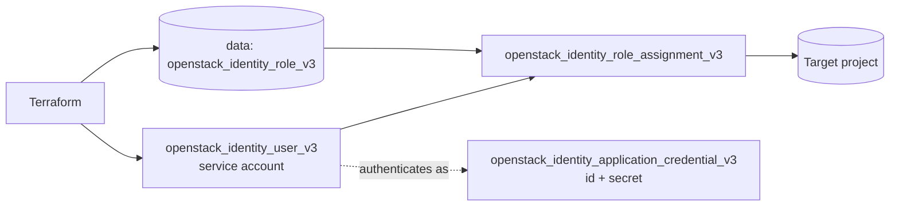

# Service Account User

> **Primary search phrase:** Terraform OpenStack service account user and application credential

Provision a non-human **machine identity** in OpenStack Keystone and issue it an
**application credential** — the preferred way for automation, CI pipelines, and
services to authenticate without embedding a long-lived password.

## Architecture



## Usage

```bash
cp terraform.tfvars.example terraform.tfvars
# edit terraform.tfvars: user_name, project_id, role_name, app_credential_*

export OS_CLOUD=openstack   # must be an admin-scoped cloud entry

terraform init
terraform plan
terraform apply

# Retrieve the one-time secret (store it in your secrets manager):
terraform output -raw application_credential_secret
```

## Why an application credential beats an embedded password

- The secret is generated by Keystone and can be **revoked independently** of the
  user without disrupting interactive access.
- It carries only the roles you scope to it, supporting least privilege.
- It avoids hardcoding the account password into pipelines or images.
- It can be given an explicit **expiry**, encouraging rotation.

## Inputs

| Name                      | Description                                          | Type     | Default              |
| ------------------------- | ---------------------------------------------------- | -------- | -------------------- |
| cloud                     | clouds.yaml entry to use                             | `string` | `"openstack"`        |
| user_name                 | Name of the service account user                     | `string` | `"svc-automation"`   |
| user_password             | Bootstrap password (sensitive)                       | `string` | n/a                  |
| project_id                | Project the role is scoped to                        | `string` | n/a                  |
| role_name                 | Role to assign on the project                        | `string` | `"member"`           |
| app_credential_name       | Name of the application credential                   | `string` | `"svc-automation-cred"` |
| app_credential_expires_at | Optional RFC3339 expiry (empty = no expiry)          | `string` | `""`                 |

## Outputs

| Name                          | Description                                         |
| ----------------------------- | --------------------------------------------------- |
| user_id                       | ID of the created service account user              |
| application_credential_id     | ID of the issued application credential             |
| application_credential_secret | Application credential secret (sensitive, shown once)|

## Best practices

- Authenticate automation with the application credential, not the password.
- Set `app_credential_expires_at` and rotate before expiry.
- Keep `ignore_password_expiry` / `ignore_change_password_upon_first_use` enabled
  so non-interactive accounts are not blocked by interactive password policy.
- Grant the minimum role required on the smallest scope.

## Security considerations

- Identity user, role, and role-assignment resources are **admin-scoped**: the
  `OS_CLOUD` entry must hold an admin token / admin role in the relevant domain.
- The user `password` is **sensitive** (passed via a `sensitive` variable and
  never exported). The application credential **secret** is also sensitive — it
  is a `sensitive = true` output and is stored in Terraform state.
- Protect Terraform state (encrypted remote backend, restricted access); anyone
  with state access can read the password and the credential secret.
- Revoke the application credential promptly if it is ever exposed.

## Troubleshooting

| Symptom                                       | Likely cause                                | Fix                                                        |
| --------------------------------------------- | ------------------------------------------- | ---------------------------------------------------------- |
| `403 Forbidden` on user create                | Credentials lack the admin role             | Use an admin-scoped `OS_CLOUD` entry                       |
| `Could not find role`                         | `role_name` does not exist                  | `openstack role list` and correct the name                 |
| App credential `expires_at` rejected          | Value is not valid RFC3339                  | Use e.g. `2027-01-01T00:00:00Z`                            |
| `Quota exceeded`                              | Application credential or user quota reached| Raise the quota (admin) or remove unused credentials       |
| Secret is empty in CLI                        | Not requested with `-raw`                   | `terraform output -raw application_credential_secret`      |

## Cleanup

```bash
terraform destroy
```

## Further reading

- [Machine identities in OpenStack with Terraform](https://devopsaitoolkit.com/blog/)
- [openstack_identity_application_credential_v3 registry docs](https://registry.terraform.io/providers/terraform-provider-openstack/openstack/latest/docs/resources/identity_application_credential_v3)
- [../../../docs/provider-configuration.md](../../../docs/provider-configuration.md)
