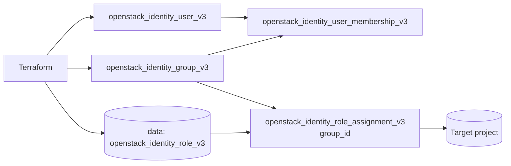

# User Group Membership

> **Primary search phrase:** Terraform OpenStack user group membership and group RBAC

Create an OpenStack identity user and a group, add the user to the group, and
grant a role to the **group** on a project. This is the recommended approach for
**group-based RBAC**: assign roles to groups once, then manage access by adding
or removing users from groups.

## Architecture



## Usage

```bash
cp terraform.tfvars.example terraform.tfvars
# edit terraform.tfvars: user_name, user_password, group_name, project_id, role_name

export OS_CLOUD=openstack   # must be an admin-scoped cloud entry

terraform init
terraform plan
terraform apply
```

## How group-based RBAC works

- Roles are assigned to the **group**, not to individual users.
- Users inherit the group's effective permissions by being members.
- Onboarding = add the user to the group; offboarding = remove the membership.
- This keeps role assignments few and auditable even as teams grow.

## Inputs

| Name          | Description                              | Type     | Default       |
| ------------- | ---------------------------------------- | -------- | ------------- |
| cloud         | clouds.yaml entry to use                 | `string` | `"openstack"` |
| user_name     | Name of the user to create              | `string` | n/a           |
| user_password | Initial password (sensitive)             | `string` | n/a           |
| group_name    | Name of the group to create              | `string` | n/a           |
| project_id    | Project the group's role is scoped to    | `string` | n/a           |
| role_name     | Role to assign to the group              | `string` | `"member"`    |

## Outputs

| Name       | Description                                                        |
| ---------- | ----------------------------------------------------------------- |
| user_id    | ID of the created identity user                                   |
| group_id   | ID of the created identity group                                  |
| membership | Membership info (membership/user/group IDs, project, role)        |

The password is intentionally **not** exported.

## Best practices

- Assign roles to groups and manage access through membership, not per-user grants.
- Name groups by team or function (e.g. `platform-engineers`) for clarity.
- Keep `terraform.tfvars` out of version control; it is gitignored.
- Rotate the bootstrap password after first login.

## Security considerations

- Identity user, group, membership, and role-assignment resources are
  **admin-scoped**: the `OS_CLOUD` entry must hold an admin token / admin role in
  the relevant domain.
- The user `password` is **sensitive**: it is passed via a `sensitive = true`
  variable and never exported. Protect Terraform state (encrypted remote backend,
  restricted ACLs) since the password is stored there.
- Review group membership and group role assignments regularly to avoid
  privilege creep.

## Troubleshooting

| Symptom                                   | Likely cause                              | Fix                                                       |
| ----------------------------------------- | ----------------------------------------- | --------------------------------------------------------- |
| `403 Forbidden` on apply                  | Credentials lack the admin role           | Use an admin-scoped `OS_CLOUD` entry                      |
| `Could not find role`                     | `role_name` does not exist                | `openstack role list` and correct the name                |
| User has no access despite membership     | Role assigned to user instead of group    | Confirm the assignment uses `group_id`                    |
| `Quota exceeded`                          | Group or user quota reached               | Raise the quota (admin) or remove unused groups/users     |
| Membership recreated each apply           | User or group recreated upstream          | Ensure user/group names are stable                        |

## Cleanup

```bash
terraform destroy
```

## Further reading

- [Group-based RBAC in OpenStack with Terraform](https://devopsaitoolkit.com/blog/)
- [openstack_identity_user_membership_v3 registry docs](https://registry.terraform.io/providers/terraform-provider-openstack/openstack/latest/docs/resources/identity_user_membership_v3)
- [../../../docs/provider-configuration.md](../../../docs/provider-configuration.md)
