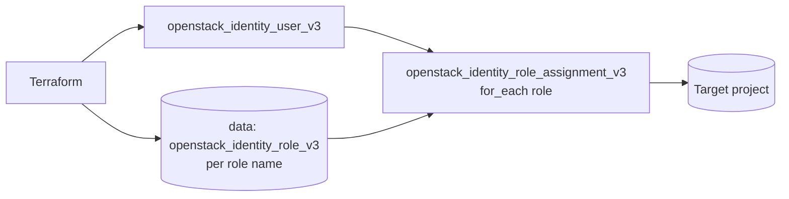

# User with Roles

> **Primary search phrase:** Terraform OpenStack create user and assign project roles

Create an OpenStack identity (Keystone) user and grant it one or more roles on a
target project. Role IDs are resolved by name at plan time, so the same code
works across clouds that use different internal role IDs.

## Architecture



## Usage

```bash
cp terraform.tfvars.example terraform.tfvars
# edit terraform.tfvars: user_name, user_password, project_id, role_names

export OS_CLOUD=openstack   # must be an admin-scoped cloud entry

terraform init
terraform plan
terraform apply
```

## Inputs

| Name          | Description                                   | Type           | Default      |
| ------------- | --------------------------------------------- | -------------- | ------------ |
| cloud         | clouds.yaml entry to use                      | `string`       | `"openstack"`|
| user_name     | Name of the identity user to create           | `string`       | n/a          |
| user_password | Initial password (sensitive)                  | `string`       | n/a          |
| project_id    | Project the roles are scoped to               | `string`       | n/a          |
| enabled       | Whether the user is enabled                   | `bool`         | `true`       |
| role_names    | Role names to assign on the project           | `list(string)` | `["member"]` |

## Outputs

| Name           | Description                                      |
| -------------- | ------------------------------------------------ |
| user_id        | ID of the created identity user                  |
| user_name      | Name of the created identity user                |
| assigned_roles | Map of role name to role ID assigned on the project |

The password is intentionally **not** exported.

## Best practices

- Resolve roles by name with the data source instead of hardcoding role IDs.
- Use `for_each` so each role assignment is tracked as its own resource and can
  be added or removed independently.
- Treat `user_password` as a bootstrap secret: rotate it after first login, or
  prefer application credentials for non-human users (see `service-account-user`).
- Keep `terraform.tfvars` out of version control; it is gitignored.

## Security considerations

- Identity user, role, and role-assignment resources are **admin-scoped**: the
  `OS_CLOUD` entry must hold an admin token / admin role in the relevant domain.
- The user `password` is **sensitive**. It is passed via a `sensitive = true`
  variable and never written to outputs. Anyone with state access can still read
  it, so protect your Terraform state (encrypted remote backend, restricted ACLs).
- Grant the least set of roles required for the user's task.

## Troubleshooting

| Symptom                                  | Likely cause                                 | Fix                                                              |
| ---------------------------------------- | -------------------------------------------- | --------------------------------------------------------------- |
| `403 Forbidden` on apply                 | Credentials lack the admin role              | Use an admin-scoped `OS_CLOUD` entry                            |
| `Could not find role`                    | Role name in `role_names` does not exist     | List roles with `openstack role list` and fix the name          |
| `Quota exceeded`                         | Domain/project user quota reached            | Raise the quota (admin) or remove unused users                  |
| Role assignment recreated every apply    | Project ID changed or role removed remotely  | Confirm `project_id` is stable and roles still exist            |

## Cleanup

```bash
terraform destroy
```

## Further reading

- [Managing OpenStack users and RBAC with Terraform](https://devopsaitoolkit.com/blog/)
- [openstack_identity_role_assignment_v3 registry docs](https://registry.terraform.io/providers/terraform-provider-openstack/openstack/latest/docs/resources/identity_role_assignment_v3)
- [../../../docs/provider-configuration.md](../../../docs/provider-configuration.md)
