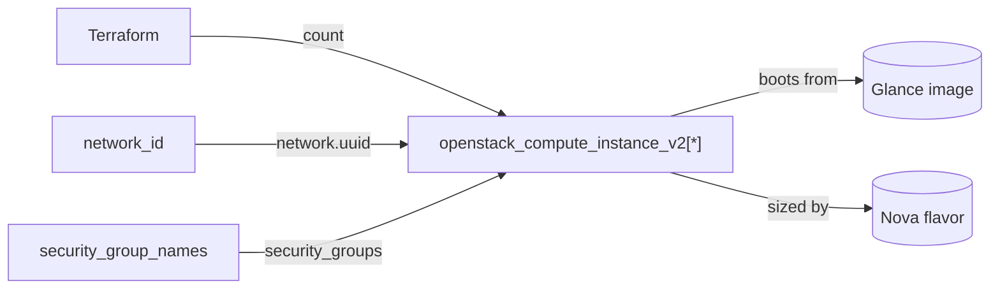

# compute

Reusable module to launch one or more identical OpenStack (Nova) compute instances on an existing tenant network.

## Usage

```hcl
module "compute" {
  source = "github.com/devopsaitoolkit/terraform-openstack-examples//modules/compute"

  name                 = "web"
  instance_count       = 3
  flavor_name          = "m1.small"
  image_name           = "ubuntu-22.04"
  network_id           = "11111111-1111-1111-1111-111111111111"
  key_pair_name        = "ops-key"
  security_group_names = ["default", "web"]
  metadata             = { role = "web" }
  tags                 = ["managed-by:terraform"]
}
```

## Requirements

| Name | Version |
|------|---------|
| terraform | >= 1.3 |
| openstack (terraform-provider-openstack/openstack) | ~> 3.0 |

## Inputs

| Name | Description | Type | Default | Required |
|------|-------------|------|---------|:--------:|
| `name` | Base name; index-suffixed when `instance_count` > 1 | `string` | n/a | yes |
| `instance_count` | Number of identical instances | `number` | `1` | no |
| `flavor_name` | Nova flavor (size) | `string` | n/a | yes |
| `image_name` | Glance image to boot | `string` | n/a | yes |
| `network_id` | UUID of the network to attach | `string` | n/a | yes |
| `key_pair_name` | Existing key pair for SSH (optional) | `string` | `""` | no |
| `security_group_names` | Security groups to attach | `list(string)` | `["default"]` | no |
| `metadata` | Per-instance metadata | `map(string)` | `{}` | no |
| `user_data` | Cloud-init user data (optional) | `string` | `""` | no |
| `availability_zone` | AZ to schedule in (optional) | `string` | `""` | no |
| `tags` | Instance tags | `list(string)` | `[]` | no |

## Outputs

| Name | Description |
|------|-------------|
| `instance_ids` | UUIDs of the created instances |
| `instance_names` | Names of the created instances |
| `access_ips` | First IPv4 address of each instance |

## Architecture



## Testing

`terraform test` runs the suite in `tests/` using `mock_provider "openstack" {}`, so no
cloud, credentials, or `terraform apply` are required. From the module directory:

```bash
terraform init
terraform test
```

## Further reading

- [Advanced OpenStack guides on DevOps AI ToolKit](https://devopsaitoolkit.com/blog/)
