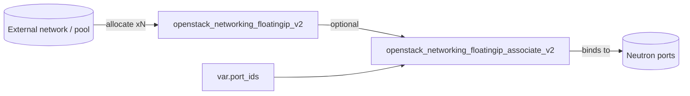

# Floating IP (Neutron)

Allocate one or more floating IPs from an external network ("pool") and,
optionally, associate each with a Neutron port. Use it to give instances or load
balancers stable public addresses.

> The number of floating IPs is controlled by `fip_count` rather than `count`,
> because Terraform reserves `count` as a variable name.

## Usage

```hcl
module "floating_ip" {
  source = "github.com/devopsaitoolkit/terraform-openstack-examples//modules/floating-ip"

  pool      = "public"
  fip_count = 2
  port_ids  = [openstack_networking_port_v2.web[0].id, openstack_networking_port_v2.web[1].id]
}
```

Pin to a release in production by appending `?ref=v1.0.0` to the `source` URL.

## Requirements

| Name | Version |
|------|---------|
| terraform | >= 1.3 |
| openstack (terraform-provider-openstack/openstack) | ~> 3.0 |

## Inputs

| Name | Description | Type | Default | Required |
|------|-------------|------|---------|:--------:|
| `pool` | External network / floating IP pool name | `string` | n/a | yes |
| `fip_count` | Number of floating IPs to allocate | `number` | `1` | no |
| `port_ids` | Ports to associate (one per FIP, by index) | `list(string)` | `[]` | no |
| `description` | Description applied to each floating IP | `string` | `""` | no |

## Outputs

| Name | Description |
|------|-------------|
| `floating_ip_addresses` | Allocated floating IP addresses, in order |
| `floating_ip_ids` | UUIDs of the allocated floating IPs, in order |

## Architecture



## Testing

Run the bundled native tests with no cloud or credentials:

```bash
cd modules/floating-ip
terraform init
terraform test
```

The tests use `mock_provider "openstack" {}` and assert at `plan` time on the
number of floating IPs allocated, the pool/description configured, and the
association count and targets when `port_ids` is supplied.

## Further reading

- [DevOps AI ToolKit](https://devopsaitoolkit.com/blog/)
