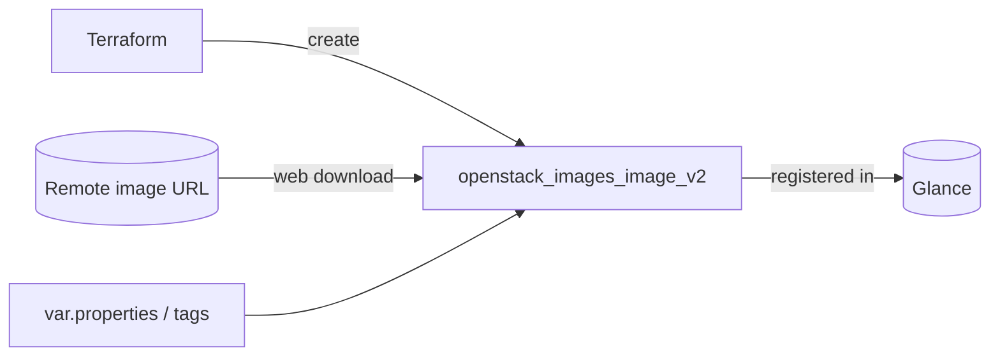

# Image (Glance)

Register a Glance image from a remote URL, with control over container/disk
formats, visibility, deletion protection, minimum disk/RAM requirements, custom
properties, and tags. Useful for building a golden-image pipeline that keeps
base images consistent and reviewable across clouds.

## Usage

```hcl
module "image" {
  source = "github.com/devopsaitoolkit/terraform-openstack-examples//modules/image"

  name             = "ubuntu-22.04-cloud"
  image_source_url = "https://cloud-images.ubuntu.com/jammy/current/jammy-server-cloudimg-amd64.img"
  disk_format      = "qcow2"
  visibility       = "private"
  min_disk_gb      = 5
  min_ram_mb       = 512

  properties = { os_distro = "ubuntu", os_version = "22.04" }
  tags       = ["managed-by:terraform"]
}
```

Pin to a release in production by appending `?ref=v1.0.0` to the `source` URL.

## Requirements

| Name | Version |
|------|---------|
| terraform | >= 1.3 |
| openstack (terraform-provider-openstack/openstack) | ~> 3.0 |

## Inputs

| Name | Description | Type | Default | Required |
|------|-------------|------|---------|:--------:|
| `name` | Name of the Glance image | `string` | n/a | yes |
| `image_source_url` | HTTP(S) URL to download the image from | `string` | n/a | yes |
| `container_format` | Container format | `string` | `"bare"` | no |
| `disk_format` | Disk format | `string` | `"qcow2"` | no |
| `visibility` | private / public / shared / community | `string` | `"private"` | no |
| `protected` | Protect from deletion | `bool` | `false` | no |
| `min_disk_gb` | Minimum disk (GB) to boot | `number` | `0` | no |
| `min_ram_mb` | Minimum RAM (MB) to boot | `number` | `0` | no |
| `properties` | Free-form image properties | `map(string)` | `{}` | no |
| `tags` | Image tags | `list(string)` | `[]` | no |

## Outputs

| Name | Description |
|------|-------------|
| `image_id` | UUID of the created image |
| `image_name` | Name of the created image |

## Architecture



## Testing

Run the bundled native tests with no cloud or credentials:

```bash
cd modules/image
terraform init
terraform test
```

The tests use `mock_provider "openstack" {}` and assert at `plan` time on the
configured image arguments (name, formats, visibility, protected, min disk/RAM,
properties) and on module outputs.

## Further reading

- [DevOps AI ToolKit](https://devopsaitoolkit.com/blog/)
