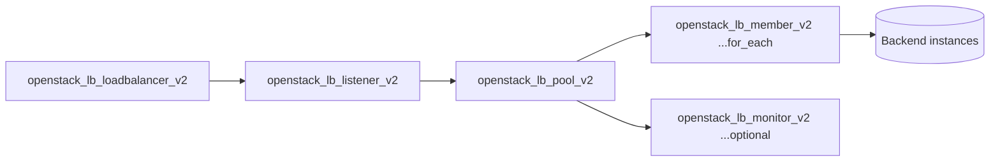

# Load Balancer (Octavia)

Provision an Octavia load balancer with a listener, a backend pool, optional
pool members, and an optional health monitor — the full layer-4/7 stack to front
a set of instances behind a single VIP.

## Usage

```hcl
module "loadbalancer" {
  source = "github.com/devopsaitoolkit/terraform-openstack-examples//modules/loadbalancer"

  name              = "web-lb"
  vip_subnet_id     = module.network.subnet_id
  listener_protocol = "HTTP"
  listener_port     = 80
  pool_method       = "ROUND_ROBIN"

  members = [
    { address = "10.0.0.11", protocol_port = 8080, subnet_id = module.network.subnet_id },
    { address = "10.0.0.12", protocol_port = 8080, subnet_id = module.network.subnet_id },
  ]

  monitor = {
    type        = "HTTP"
    delay       = 5
    timeout     = 3
    max_retries = 3
    url_path    = "/healthz"
  }
}
```

Pin to a release in production by appending `?ref=v1.0.0` to the `source` URL.

## Requirements

| Name | Version |
|------|---------|
| terraform | >= 1.3 |
| openstack (terraform-provider-openstack/openstack) | ~> 3.0 |

## Inputs

| Name | Description | Type | Default | Required |
|------|-------------|------|---------|:--------:|
| `name` | Load balancer name (prefix for listener/pool) | `string` | n/a | yes |
| `vip_subnet_id` | Subnet for the VIP | `string` | n/a | yes |
| `listener_protocol` | Listener and pool protocol | `string` | `"HTTP"` | no |
| `listener_port` | Listener port | `number` | `80` | no |
| `pool_method` | Load balancing algorithm | `string` | `"ROUND_ROBIN"` | no |
| `members` | Backend members: `list(object({ address, protocol_port, subnet_id }))` | `list(object)` | `[]` | no |
| `monitor` | Optional health monitor object (or `null`) | `object` | `null` | no |
| `tags` | Tags applied to the load balancer | `list(string)` | `[]` | no |

## Outputs

| Name | Description |
|------|-------------|
| `loadbalancer_id` | UUID of the load balancer |
| `vip_address` | VIP address of the load balancer |
| `pool_id` | UUID of the pool |

## Architecture



## Testing

Run the bundled native tests with no cloud or credentials:

```bash
cd modules/loadbalancer
terraform init
terraform test
```

The tests use `mock_provider "openstack" {}` and assert at `plan` time on the
listener protocol/port, pool method, member count and per-member arguments, and
whether the health monitor is created based on the `monitor` input.

## Further reading

- [DevOps AI ToolKit](https://devopsaitoolkit.com/blog/)
