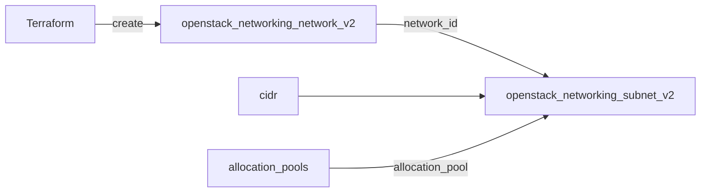

# networking

Reusable module that creates an OpenStack tenant network plus a matching subnet (with optional DHCP and allocation pools).

## Usage

```hcl
module "networking" {
  source = "github.com/devopsaitoolkit/terraform-openstack-examples//modules/networking"

  name            = "app-net"
  cidr            = "10.0.10.0/24"
  dns_nameservers = ["1.1.1.1", "8.8.8.8"]
  allocation_pools = [
    { start = "10.0.10.10", end = "10.0.10.200" },
  ]
  tags = ["managed-by:terraform"]
}
```

## Requirements

| Name | Version |
|------|---------|
| terraform | >= 1.3 |
| openstack (terraform-provider-openstack/openstack) | ~> 3.0 |

## Inputs

| Name | Description | Type | Default | Required |
|------|-------------|------|---------|:--------:|
| `name` | Network name (subnet is `<name>-subnet`) | `string` | n/a | yes |
| `cidr` | Subnet CIDR block | `string` | n/a | yes |
| `dns_nameservers` | DNS resolvers handed out via DHCP | `list(string)` | `[]` | no |
| `enable_dhcp` | Enable DHCP on the subnet | `bool` | `true` | no |
| `allocation_pools` | DHCP allocation ranges (`start`/`end`) | `list(object)` | `[]` | no |
| `ip_version` | IP version (4 or 6) | `number` | `4` | no |
| `tags` | Tags for network and subnet | `list(string)` | `[]` | no |

## Outputs

| Name | Description |
|------|-------------|
| `network_id` | UUID of the network |
| `subnet_id` | UUID of the subnet |
| `network_name` | Name of the network |
| `cidr` | CIDR of the subnet |

## Architecture



## Testing

`terraform test` runs the suite in `tests/` using `mock_provider "openstack" {}`, so no
cloud, credentials, or `terraform apply` are required. From the module directory:

```bash
terraform init
terraform test
```

## Further reading

- [Advanced OpenStack guides on DevOps AI ToolKit](https://devopsaitoolkit.com/blog/)
