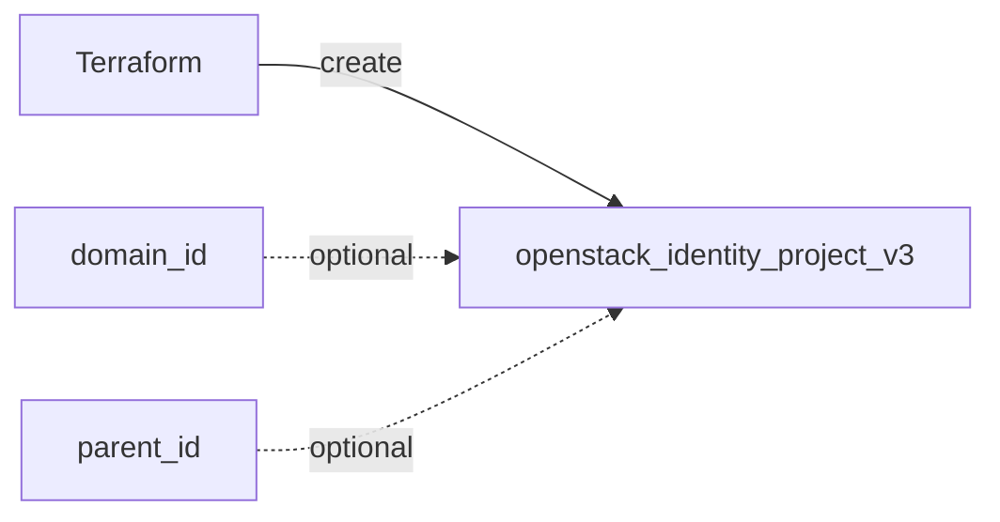

# project

Reusable module that creates a Keystone (Identity v3) project, optionally scoped to a domain or a parent project.

## Usage

```hcl
module "project" {
  source = "github.com/devopsaitoolkit/terraform-openstack-examples//modules/project"

  name        = "research"
  description = "Research sandbox"
  enabled     = true
  tags        = ["managed-by:terraform", "team:research"]
}
```

## Requirements

| Name | Version |
|------|---------|
| terraform | >= 1.3 |
| openstack (terraform-provider-openstack/openstack) | ~> 3.0 |

## Inputs

| Name | Description | Type | Default | Required |
|------|-------------|------|---------|:--------:|
| `name` | Project name | `string` | n/a | yes |
| `description` | Project description | `string` | `""` | no |
| `domain_id` | Domain to create the project in (optional) | `string` | `""` | no |
| `enabled` | Whether the project is enabled | `bool` | `true` | no |
| `tags` | Tags for the project | `list(string)` | `[]` | no |
| `parent_id` | Parent project for nested tenancy (optional) | `string` | `""` | no |

## Outputs

| Name | Description |
|------|-------------|
| `project_id` | UUID of the project |
| `project_name` | Name of the project |

## Architecture



## Testing

`terraform test` runs the suite in `tests/` using `mock_provider "openstack" {}`, so no
cloud, credentials, or `terraform apply` are required. From the module directory:

```bash
terraform init
terraform test
```

## Further reading

- [Advanced OpenStack guides on DevOps AI ToolKit](https://devopsaitoolkit.com/blog/)
