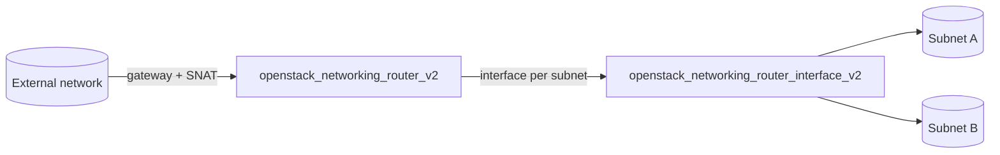

# Router (Neutron)

Create a Neutron router with an external gateway and attach one or more tenant
subnets to it. This gives instances on private subnets north-south connectivity
and is the anchor point for floating IPs.

## Usage

```hcl
module "router" {
  source = "github.com/devopsaitoolkit/terraform-openstack-examples//modules/router"

  name                = "edge-router"
  external_network_id = data.openstack_networking_network_v2.ext.id
  enable_snat         = true
  subnet_ids          = [module.network.subnet_id]
}
```

Pin to a release in production by appending `?ref=v1.0.0` to the `source` URL.

## Requirements

| Name | Version |
|------|---------|
| terraform | >= 1.3 |
| openstack (terraform-provider-openstack/openstack) | ~> 3.0 |

## Inputs

| Name | Description | Type | Default | Required |
|------|-------------|------|---------|:--------:|
| `name` | Name of the router | `string` | n/a | yes |
| `external_network_id` | External network used as gateway | `string` | n/a | yes |
| `enable_snat` | Enable source NAT on the gateway | `bool` | `true` | no |
| `subnet_ids` | Tenant subnets to attach as interfaces | `list(string)` | `[]` | no |
| `admin_state_up` | Administrative state of the router | `bool` | `true` | no |

## Outputs

| Name | Description |
|------|-------------|
| `router_id` | UUID of the created router |
| `router_name` | Name of the created router |
| `external_gateway` | External network ID used as the gateway |

## Architecture



## Testing

Run the bundled native tests with no cloud or credentials:

```bash
cd modules/router
terraform init
terraform test
```

The tests use `mock_provider "openstack" {}` and assert at `plan` time on router
arguments (name, external network, SNAT, admin state), the number of router
interfaces created from `subnet_ids`, and module outputs.

## Further reading

- [DevOps AI ToolKit](https://devopsaitoolkit.com/blog/)
