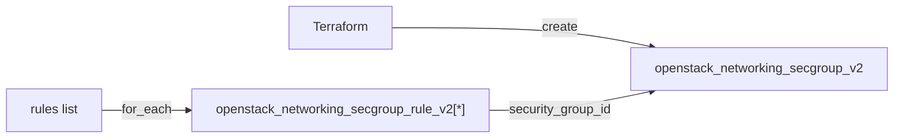

# security-group

Reusable module that creates an OpenStack security group and a configurable set of ingress/egress rules.

## Usage

```hcl
module "security_group" {
  source = "github.com/devopsaitoolkit/terraform-openstack-examples//modules/security-group"

  name        = "web"
  description = "Public web tier"
  rules = [
    { direction = "ingress", ethertype = "IPv4", protocol = "tcp", port_min = 443, port_max = 443, remote_ip_prefix = "0.0.0.0/0" },
    { direction = "ingress", ethertype = "IPv4", protocol = "tcp", port_min = 22, port_max = 22, remote_ip_prefix = "10.0.0.0/8" },
  ]
  tags = ["managed-by:terraform"]
}
```

## Requirements

| Name | Version |
|------|---------|
| terraform | >= 1.3 |
| openstack (terraform-provider-openstack/openstack) | ~> 3.0 |

## Inputs

| Name | Description | Type | Default | Required |
|------|-------------|------|---------|:--------:|
| `name` | Security group name | `string` | n/a | yes |
| `description` | Group description | `string` | `"Managed by Terraform"` | no |
| `rules` | List of rule objects (see below) | `list(object)` | `[]` | no |
| `tags` | Tags for the security group | `list(string)` | `[]` | no |

Each `rules` entry: `direction` (ingress/egress), `ethertype` (IPv4/IPv6), optional `protocol`, `port_min`, `port_max`, `remote_ip_prefix`.

## Outputs

| Name | Description |
|------|-------------|
| `security_group_id` | UUID of the security group |
| `security_group_name` | Name of the security group |

## Architecture



## Testing

`terraform test` runs the suite in `tests/` using `mock_provider "openstack" {}`, so no
cloud, credentials, or `terraform apply` are required. From the module directory:

```bash
terraform init
terraform test
```

## Further reading

- [Advanced OpenStack guides on DevOps AI ToolKit](https://devopsaitoolkit.com/blog/)
