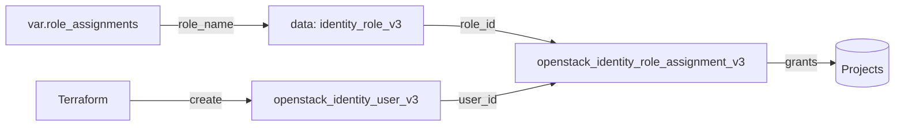

# User (Keystone Identity v3)

Create an OpenStack Keystone user and grant it roles on one or more projects.
Role names are resolved to IDs with a data source, so you describe access the way
operators think about it ("member on project X") instead of pasting UUIDs. The
user's password is treated as write-only and is never exposed as an output.

## Usage

```hcl
module "user" {
  source = "github.com/devopsaitoolkit/terraform-openstack-examples//modules/user"

  name    = "app-service-account"
  enabled = true

  role_assignments = [
    { role_name = "member", project_id = var.project_id },
    { role_name = "reader", project_id = var.audit_project_id },
  ]
}
```

Pin to a release in production by appending `?ref=v1.0.0` to the `source` URL.

## Requirements

| Name | Version |
|------|---------|
| terraform | >= 1.3 |
| openstack (terraform-provider-openstack/openstack) | ~> 3.0 |

## Inputs

| Name | Description | Type | Default | Required |
|------|-------------|------|---------|:--------:|
| `name` | Name of the Identity v3 user | `string` | n/a | yes |
| `password` | Initial password (write-only, never output) | `string` (sensitive) | `""` | no |
| `default_project_id` | Default project scope; `""` leaves unset | `string` | `""` | no |
| `domain_id` | Owning domain; `""` uses provider default | `string` | `""` | no |
| `enabled` | Whether the user can authenticate | `bool` | `true` | no |
| `role_assignments` | Roles to grant: `list(object({ role_name, project_id }))` | `list(object)` | `[]` | no |

## Outputs

| Name | Description |
|------|-------------|
| `user_id` | UUID of the created user |
| `user_name` | Name of the created user |

## Architecture



## Testing

Run the bundled native tests with no cloud or credentials:

```bash
cd modules/user
terraform init
terraform test
```

The tests use `mock_provider "openstack" {}` so every resource and data source is
mocked. Assertions run at `plan` time against configured arguments (user name,
`enabled`, role-assignment count/targets) and module outputs.

## Further reading

- [DevOps AI ToolKit](https://devopsaitoolkit.com/blog/)
