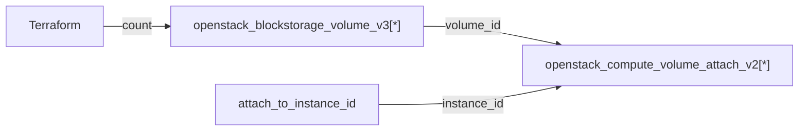

# volume

Reusable module that creates one or more Cinder block-storage volumes and optionally attaches them to a compute instance.

## Usage

```hcl
module "volume" {
  source = "github.com/devopsaitoolkit/terraform-openstack-examples//modules/volume"

  name                  = "data"
  size                  = 100
  volume_count          = 2
  volume_type           = "ssd"
  attach_to_instance_id = "22222222-2222-2222-2222-222222222222"
  metadata              = { role = "data" }
}
```

## Requirements

| Name | Version |
|------|---------|
| terraform | >= 1.3 |
| openstack (terraform-provider-openstack/openstack) | ~> 3.0 |

## Inputs

| Name | Description | Type | Default | Required |
|------|-------------|------|---------|:--------:|
| `name` | Base volume name; index-suffixed when `volume_count` > 1 | `string` | n/a | yes |
| `size` | Size of each volume in GB | `number` | n/a | yes |
| `volume_count` | Number of volumes to create | `number` | `1` | no |
| `volume_type` | Cinder volume type (optional) | `string` | `""` | no |
| `availability_zone` | AZ for the volumes (optional) | `string` | `""` | no |
| `metadata` | Per-volume metadata | `map(string)` | `{}` | no |
| `attach_to_instance_id` | Instance UUID to attach volumes to (optional) | `string` | `""` | no |

> `count` is a reserved Terraform variable name, so the multiplicity input is named `volume_count`.

## Outputs

| Name | Description |
|------|-------------|
| `volume_ids` | UUIDs of the created volumes |
| `attachment_ids` | IDs of the volume attachments (empty when not attached) |

## Architecture



## Testing

`terraform test` runs the suite in `tests/` using `mock_provider "openstack" {}`, so no
cloud, credentials, or `terraform apply` are required. From the module directory:

```bash
terraform init
terraform test
```

## Further reading

- [Advanced OpenStack guides on DevOps AI ToolKit](https://devopsaitoolkit.com/blog/)
